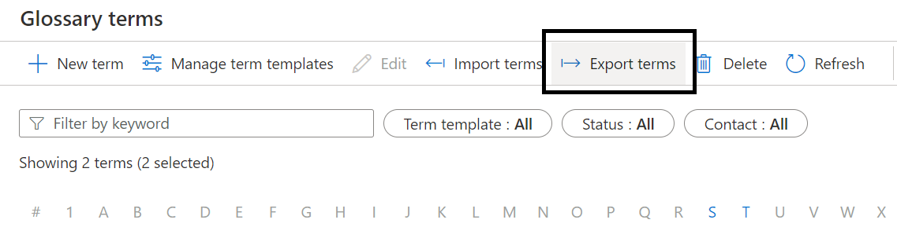
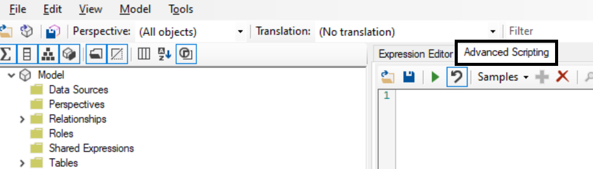

# Enhance PBI semantic model with glossary terms from Azure Purview

In this technical article I will show how to extract KPI definitons from the [Azure Purview Business Glossary](https://docs.microsoft.com/en-us/azure/purview/concept-business-glossary) and use them to enhance a Power BI semantic model, using the brilliant [Advanced Scripting](https://docs.tabulareditor.com/te2/Advanced-Scripting.html) feature available in [Tabular Editor](https://docs.tabulareditor.com/index.html). 


## Extract the glossary terms from Azure Purview

First I need a Purview account created. I can use the [this tutorial](https://docs.microsoft.com/en-us/azure/purview/create-catalog-portal) describing in detail how to create a new Azure Purview catalog in the Azure portal. 
Next, I need to populate the business glossary in Azure Purview with some relevant terms, as described in [this tutorial](https://docs.microsoft.com/en-us/azure/purview/how-to-create-import-export-glossary). For this scenario to work, I will make sure the terms I am defining in the business glossary represent measures in my Power BI semantic model(dataset), and the names of the terms match the names of the Power BI measures. 


For exporting the glossary terms from Purview onto my local machine I have a few options:

**Option 1** Manually from the Purview Studio Portal:


Please note I need to select the terms I wish to export, or Select All, before the Export terms option becomes clickable. 

**Option 2** Using the Purview Python CLI 

For this option I will use the [Purview Python CLI](https://https://aka.ms/purviewcli). Please note the purviewcli package works on the following Python versions, one of which I will need to have installed for the following script to work:

* Python 3.6+
* Python 3.7+
* Python 3.8+
* Python 3.9+

Since I am running all this on a Windows 10 machine, I choose to use a Power Shell script to automate the CLI commands. 

```
Purview KPI Download.ps1

# create a virtual environment for Python in order to better manage the various dependencies
python3 -m venv new-env

# activate the newly created environment
new-env\Scripts\activate

# install Purview CLI 
pip install purviewcli

# provide environment variavbles for connecting to Azure Purview via service principal
$env:PURVIEW_NAME = "XXXXXXXXXXXX"
$env:AZURE_CLIENT_ID = "XXXXXXXXXXXX"
$env:AZURE_TENANT_ID = "XXXXXXXXXXXX"
$env:AZURE_CLIENT_SECRET = "XXXXXXXXXXXX"

<# 
read all the glossary terms and write them as the "KPIExport.csv" file. Name and location of the file can be changed here 
#>
(pv glossary readTerms | ConvertFrom-Json) | Export-CSV "KPIexport.csv" -NoTypeInformation

# deactivate the virtual environment
deactivate new-env
```

More details on how the authentication and authorization work in the purviewcli can be found [here](https://github.com/tayganr/purviewcli#authentication). Also, details on how to set up a service pricipal for Azure Purview can be found [here](https://docs.microsoft.com/en-us/azure/purview/tutorial-using-rest-apis).

I can now execute the PowerShell script above from the:

*  PowerShell terminal 
```
PS> & '.\Purview KPI Download.ps1'
```
*  Command prompt
```
CMD> PowerShell.exe -File "Purview KPI Download.ps1"
```

I can now extend these scripts to schedule the export of glossary terms on a regular basis (Windows Task Scheduler is one utility I could use for this). 

**Option 3** Using the [Purview API](https://docs.microsoft.com/en-us/rest/api/purview/catalogdataplane/glossary/list-glossary-terms)


## Enhance the Power BI semanting model

In this section I will enhance the Power BI semanting model by updating the measure descriptions with the term descripions form Azure Purview.

First I will open the PBIX file containig the model I wish to enhance. Next, I need to start Tabular Editor, which I can do from the External Tools menu of Power BI Desktop.


In Tabular Editor, I need to go to the Advance Scripting section



and run the following script: 

```
//Location of the KPIexport.csv file previously exported
var KPIDefinition = ReadFile("C:\\scripts\\KPIexport.csv");

var kpiRows = KPIDefinition.Split(new[] {'\r','\n'},StringSplitOptions.RemoveEmptyEntries);

//parse the KPI file row by row
foreach(var row in kpiRows.Skip(1))
{
    var csvColumns = row.Split(',');     
    var name = csvColumns[3].Trim('"');         //name of the term
    var description = csvColumns[2].Trim('"');  //description of the term
    var status = csvColumns[6].Trim('"');       //status of the terms. I could filter the terms based on status (for example, do not use Draft terms)
    
    //loop through all the measures in the model
    foreach(var mes in Model.AllMeasures)
    {        
        if (mes.Name == name)//if a measure has the same name as a term
        {
            mes.Description = description; //update the description of the measure
        }
            
    }
    
}
```

Please note the position of the name, description and status fields may have to be changed if using an input file with a different format. 

Once the script was succesfully executed, I need to save the changes back to the model:


Going back to Power BI Desktop, I should now be able to see the updated descriptions for the relevant measures:


Optionally, in Tabular Editor I could save the script as a Custom Action, to make it easy to update the measure definitions on a regular basis without having to remember the script.

Save script as custom action:


Use saved custom action:


## Additional resources
- [Using scripts in Tabular Editor](https://www.youtube.com/watch?v=EHs5r3XCkO8)
- [CLI wrapper to Azure Purview APIs (purviewcli)](https://www.youtube.com/watch?v=ycr1G5iMM6U)